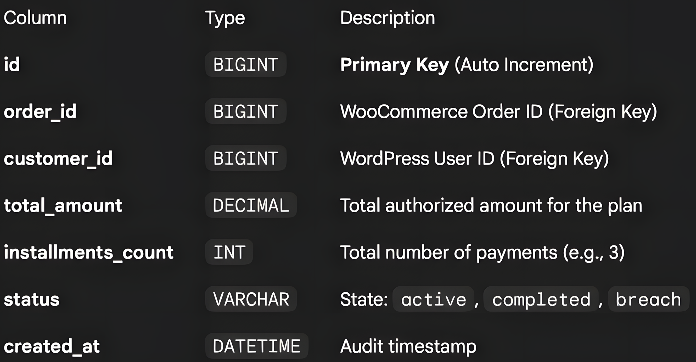
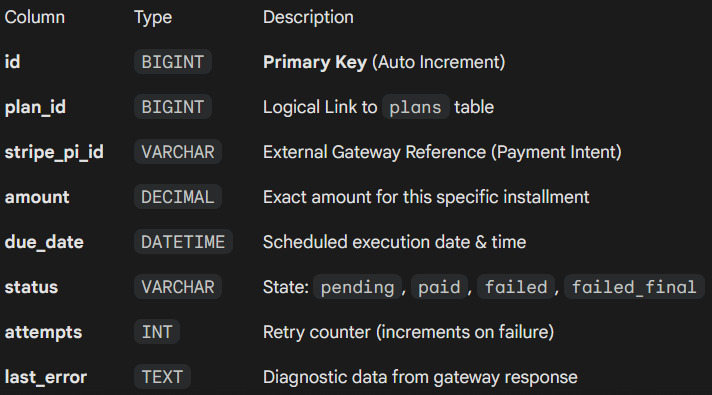

# WC Installment Payments Engine

   

> **Enterprise-grade installment payment processing for WooCommerce.**

This plugin implements a robust, event-driven payment engine designed to decouple payment scheduling from the immediate checkout flow. It prioritizes **data integrity**, **automatic recovery**, and **observability** over simple integration.

### Key Architectural Highlights

* **Service-Locator Pattern:** Lightweight orchestration via a centralized `Plugin` class to manage dependencies and lazy-loading.
* **Custom Data Layer:** Dedicated SQL tables (via `dbDelta`) for high-performance querying, decoupling financial state from the heavy `wp_posts` table.
* **Resilient Scheduling:** A self-healing background worker that handles retries and failures without blocking the main thread.
* **Penny-Perfect Calculation:** Financial arithmetic engine ensuring zero-cent loss during installment splitting.
* **Security First:** HMAC-signed webhooks for secure communication with external recovery systems.

---

## Table of Contents

- [WC Installment Payments Engine](#wc-installment-payments-engine)
    - [Key Architectural Highlights](#key-architectural-highlights)
  - [Table of Contents](#table-of-contents)
  - [Project Structure](#project-structure)
  - [Data Architecture](#data-architecture)
    - [Plan Repository (`wp_wcip_installment_plans`)](#plan-repository-wp_wcip_installment_plans)
    - [Payment Ledger (`wp_wcip_installment_payments`)](#payment-ledger-wp_wcip_installment_payments)
  - [Core Workflows](#core-workflows)
    - [1. Checkout \& Plan Generation](#1-checkout--plan-generation)
    - [2. The Scheduler Loop](#2-the-scheduler-loop)
    - [3. Retry Strategy (Smart Recovery)](#3-retry-strategy-smart-recovery)
    - [4. Webhook Dispatcher (Recovery)](#4-webhook-dispatcher-recovery)
    - [Admin Interface](#admin-interface)
    - [Plan List View](#plan-list-view)
    - [Plan Detail View](#plan-detail-view)
  - [Installation \& Configuration](#installation--configuration)
  - [Development Notes](#development-notes)
    - [Debugging \& Logs](#debugging--logs)
    - [Manual Triggering](#manual-triggering)
  - [Future Roadmap](#future-roadmap)

---

## Project Structure

The codebase follows **PSR-4** standards and separates concerns into logical domains (`Core`, `Payments`, `Admin`).

```text
wc-installment-payments/
├── wc-installment-payments.php       # Entry Point: Bootstrap & Hook Registration
├── uninstall.php                     # Teardown: Clean up SQL/Options
├── src/
│   ├── Plugin.php                    # Orchestrator: Dependency Injection & Wiring
│   ├── Core/                         # Infrastructure Layer
│   │   ├── Activator.php             # Schema Migration (dbDelta)
│   │   ├── Deactivator.php           # Cron Cleanup
│   │   ├── Scheduler.php             # Cron Event Handler
│   │   └── WebhookDispatcher.php     # External Notification Service (HMAC)
│   ├── Payments/                     # Domain Logic Layer
│   │   ├── PlanManager.php           # DAO for Installment Plans
│   │   ├── PaymentManager.php        # DAO for Individual Transactions
│   │   ├── CheckoutHandler.php       # WooCommerce Integration Bridge
│   │   └── RetryStrategy.php         # Algorithm: Recovery Logic (Pure PHP)
│   └── Admin/                        # Presentation Layer
│       ├── AdminMenu.php             # Routing & Controllers
│       ├── PlanListTable.php         # WP_List_Table Implementation
│       └── PlanDetailView.php        # Detailed Reporting View
└── README.md
```
## Data Architecture

The engine bypasses standard WordPress Post Meta to ensure ACID-compliant transactions and efficient querying for high-volume stores.

### Plan Repository (`wp_wcip_installment_plans`)

Represents the "parent" agreement linked to the WooCommerce Order.

> 

### Payment Ledger (`wp_wcip_installment_payments`)

Represents the individual transaction schedule.

> 

> **Note:** Foreign Keys are logical at this stage to maintain compatibility with dbDelta, but the application layer enforces integrity.

## Core Workflows

### 1. Checkout & Plan Generation

* **Handler:** `src/Payments/CheckoutHandler.php`
* **Hook:** `woocommerce_checkout_order_processed`

When an order exceeds the configured threshold (e.g., **100€**), the system engages the Installment Engine:

1.  **Transaction Start:** Initiates an SQL transaction (`START TRANSACTION`).
2.  **Plan Initialization:** Creates the parent record.
3.  **Penny-Perfect Calculation:** Splits the total ensuring no floating-point errors.
    > *Example:* 100€ / 3 installments
    > *Result:* `33.33` + `33.33` + `33.34`
4.  **Ledger Creation:**
    * **Installment 1:** Marked `paid` (captured by standard WC Checkout).
    * **Installment 2+:** Marked `pending` with future `due_date` (D+30, D+60).
5.  **Commit:** Finalizes the transaction.

### 2. The Scheduler Loop

* **Handler:** `src/Core/Scheduler.php`
* **Cron Event:** `wcip_hourly_process`

The background worker operates on a **"Fetch-Lock-Process"** model to handle high throughput:

1.  **Fetch:** `PaymentManager::get_due_payments()` retrieves all `pending` items where `due_date <= NOW()`.
2.  **Process:** Iterates through payments securely (try/catch block per item).
3.  **Execute:** Calls `StripeService::charge_saved_card()` (Simulation).
4.  **Result:**
    * **Success:** Updates status to `paid`.
    * **Failure:** Triggers `wcip_payment_failed` action.

### 3. Retry Strategy (Smart Recovery)

* **Handler:** `src/Payments/RetryStrategy.php`
* **Type:** Pure PHP logic (Unit Testable)

The system implements a deterministic recovery strategy to maximize revenue recovery while minimizing gateway spam.

* **Trigger:** Payment failure in Scheduler.
* **Logic:**
    * Attempt 1 fail → Reschedule to **D+3**
    * Attempt 2 fail → Reschedule to **D+7**
    * Attempt 3 fail → Reschedule to **D+14**
    * Attempt 4 fail → **Hard Failure**
* **Outcome:**
    * *If retrying:* Status remains `pending`, `due_date` updated.
    * *If exhausted:* Status becomes `failed_final`, Plan becomes `breach`, `wcip_payment_failed_final` action fired.

### 4. Webhook Dispatcher (Recovery)

* **Handler:** `src/Core/WebhookDispatcher.php`

Upon a `failed_final` event, the system dispatches a secure notification to external dunning/collections software.

**Security Specification:**

* **Method:** POST (Async/Non-blocking)
* **Signature:** `X-WCIP-Signature` header containing `HMAC-SHA256` of the payload.
* **Verification:** Receiver uses the shared `secret_key` to validate payload integrity and origin.

### Admin Interface

The plugin extends the WooCommerce dashboard to provide full visibility into the installment ledger.

### Plan List View

Located at **WooCommerce → Installment Plans**. Built on top of the native `WP_List_Table` for consistency with WordPress UI standards. Includes:
* Sortable columns
* Status badges
* Pagination

### Plan Detail View

Provides a granular view of a specific plan, including:
* Summary metrics (Total paid, remaining).
* Detailed schedule table (Stripe IDs, attempt counts, last error logs).

---

## Installation & Configuration

1.  **Deploy:** Upload the `wc-installment-payments` directory to `wp-content/plugins/`.
2.  **Activate:** Enable via WP Admin. Database migrations run automatically via `Activator::activate()`.
3.  **Configure keys:** Go to **WooCommerce → Installment Settings** and set:
    * **Stripe API key**
    * **Webhook URL**
    * **Webhook secret**
    
    Alternatively, you can define constants in `wp-config.php`:
    * `WCIP_STRIPE_API_KEY`
    * `WCIP_WEBHOOK_URL`
    * `WCIP_WEBHOOK_SECRET`

---

## Development Notes

### Debugging & Logs
The system writes to the standard PHP `error_log` for critical events:
* Transaction rollbacks during checkout.
* Scheduler execution times and batch counts.
* Webhook response codes.

### Manual Triggering
To force the scheduler without waiting for WP-Cron (useful for local dev):

```bash
wp cron event run wcip_hourly_process
```

You can also use **WooCommerce → Payment Plans → Direct URL** (nonce-protected) to trigger the scheduler and redirect back to the list.

---

## Future Roadmap

* **Multi-gateway Support:** Extend beyond Stripe to support PayPal, Braintree, etc.
* **Advanced Analytics:** Dashboard with revenue projections and success rates.
* **Customer Portal:** Frontend interface for customers to manage their installment plans.
* **API Endpoints:** RESTful API for third-party integrations.